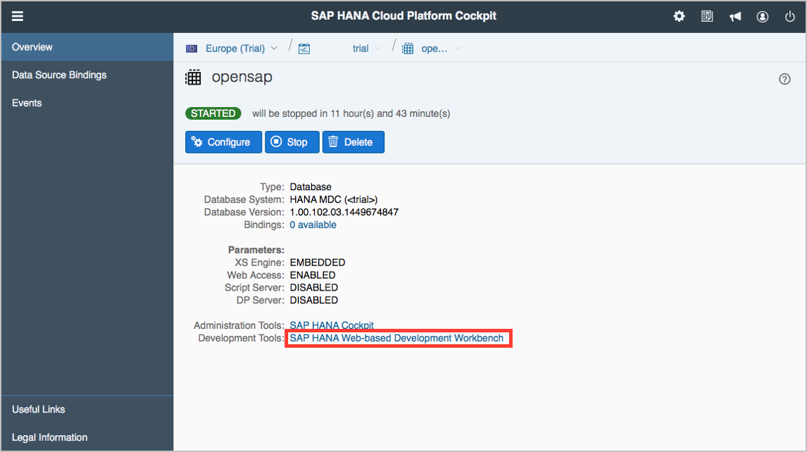
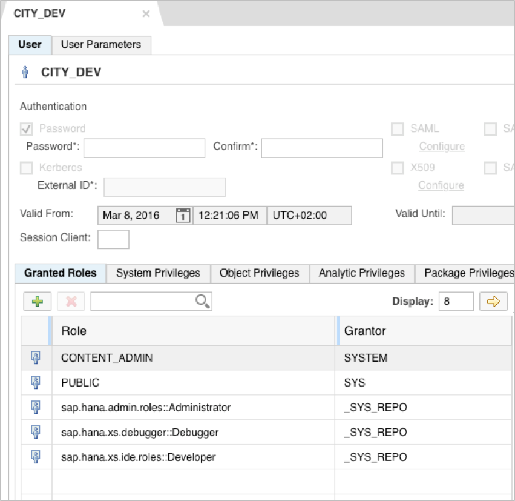

# hana-cities
Cities is a sample applicaion that demonstrate OData service using HANA XS Engine for execution.

# Quick Start

Clone the repo, `git clone https://github.com/sap/hana-cities.git`, or [download the repo as a ZIP archive](https://github.com/sap/hana-cities/archive/master.zip).

# Project Overview

Here is a basic description of the project. The structure is as follows:

* **/cities/data/*** - in this package are located files that holds the definition and information about the database schema, database table, sample data and custom user role
* **/cities/services/*** - in this package is located the OData service
* **/cities/.xsaccess** - XS access configuration file
* **/cities/.xsapp** - XS metadata file 
* **/cities/index.html** - the default genarated home page for the application

# Getting Started

1. Login to your HANA MDC database with the **SYSTEM** user
	

2. Create new user - **CITY_DEV**
	
	
3. Assign the following roles:
	* **CONTENT_ADMIN**
	* **sap.hana.admin.roles::Administrator**
	* **sap.hana.xs.debugger::Debugger**
	* **sap.hana.xs.ide.roles::Developer**
4. Grant the following **Object Privileges**:
	* **GRANT\_ACTIVATED\_ROLE::Execute**
5. Logout and login to **SAP HANA Web-based Development Workbench Editor** with the **CITY_DEV** user
6. Create new application - **cities**
	* Create new package - **data**
	* Create new package - **services**
7. Copy all files from the project structure described in section **Project Overview**, to the newly created **cities** application
8. Activate the **cities** application
9. Assign the **cities.data::user** role to the **CITY_DEV** user
10. Open **OData Explorer** for **cities.xsodata**
	

# References 
* <a href="http://www.saphana.com/docs/DOC-3773" target="_blank">**Core Data Services**</a>
* For more information refer to the <a href="http://help.sap.com/hana/SAP_HANA_Developer_Guide_en.pdf" target="_blank">**SAP HANA Developer Guide**</a>

# Copyright and License

Copyright 2016 SAP SE

Licensed under the Apache License, Version 2.0 (the "License"); you may not use this work except in compliance with the License. You may obtain a copy of the License in the LICENSE file, or at:

<a href="http://www.apache.org/licenses/LICENSE-2.0" target="_blank">http://www.apache.org/licenses/LICENSE-2.0</a>

Unless required by applicable law or agreed to in writing, software distributed under the License is distributed on an "AS IS" BASIS, WITHOUT WARRANTIES OR CONDITIONS OF ANY KIND, either express or implied. See the License for the specific language governing permissions and limitations under the License.

Find the project description at documents/index.html
